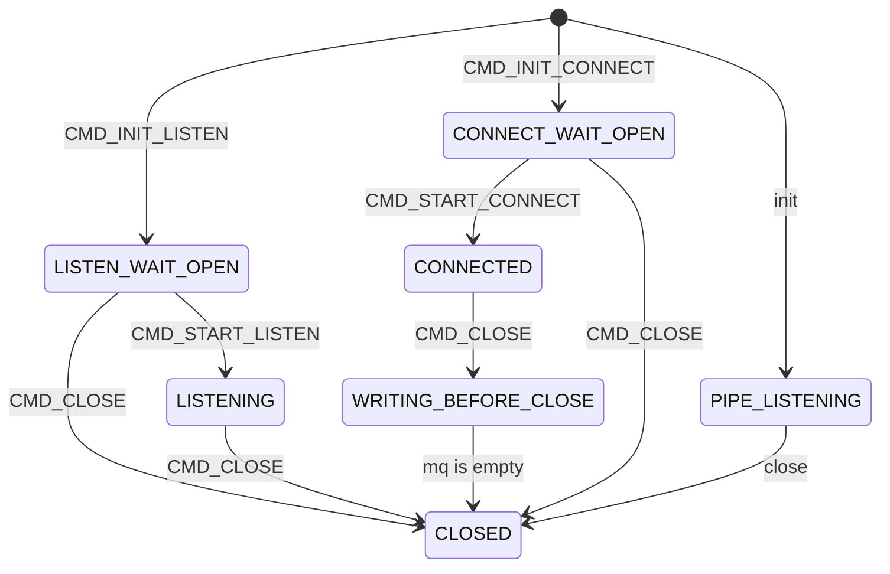

# before using
need g++ version >= 17
in linux
```
sudo apt install protobuf-compiler libprotobuf-dev
```
in macos
```
brew install protobuf
```
# using
- using vscode open the root folder
- run the launch task named "server Launch" or "client Launch" to test the socket code
- run the launch task named "test serialize" to test serialize code

# net work state machine
